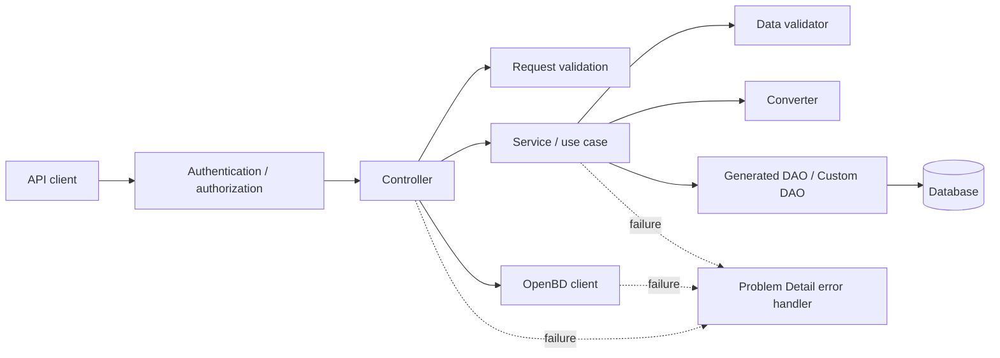

# 書籍・仕入管理 API 移植向け詳細設計書

## 1. 目的と読み方

本書は、現在の Java 21 / Spring Boot サンプルを根拠に、他言語・他 Web フレームワーク・他 ORM / SQL ライブラリでも同等機能を実装できるよう、API 契約、認証、業務ルール、データモデル、エラー仕様、トランザクションと同時更新要件を実装技術から独立して定義する。

Spring Boot、Spring Security、Bean Validation、JPA、MyBatis、Doma、jOOQ などの実装詳細は後半の「Spring 参考実装対応表」に分離する。移植先では同等の責務を持つ仕組みに置き換えてよいが、エンドポイント、JSON 項目名、入力制約、HTTP status、業務処理順、DB 制約、排他制御は本書に合わせる。

主な根拠:

- API インターフェイス: `docs/openapi.yaml`
- Spring 参考実装の API interface: `src/main/java/com/example/demo/api/*OperationApi.java`
- DTO 制約: `src/main/java/com/example/demo/api/request`, `src/main/java/com/example/demo/api/response`
- 認証・認可: `src/main/java/com/example/demo/config/SecurityConfig.java`, `JwtTokenService.java`, `LoginRateLimitService.java`
- 例外仕様: `src/main/java/com/example/demo/config/GlobalExceptionHandler.java`
- 業務処理: `src/main/java/com/example/demo/*/service`, `src/main/java/com/example/demo/*/validator`, `src/main/java/com/example/demo/*/converter`
- DB スキーマ: `src/main/resources/generator-schema.sql`
- 初期データ・設定値: `src/main/resources/data.sql`, `src/main/resources/application.yaml`

## 2. システム概要

対象システムは、書籍、出版社、ジャンル、販売単価履歴、店舗別在庫、在庫増減履歴、仕入伝票、仕入明細を管理する JSON REST API である。

機能:

- ログイン、Bearer token 発行、ログイン回数制限、回数制限リセット
- 書籍の取得、検索、登録、更新、削除
- 書籍の販売単価履歴追加
- OpenBD API による外部書誌情報取得
- 仕入伝票登録、仕入明細登録、在庫加算、在庫増減履歴登録

現行サンプルは JPA / MyBatis / Doma / jOOQ の複数永続化実装を持つ。移植時は 1 種類の永続化方式でよい。ただし、全永続化実装で共通している仕様を本書の正とする。

## 3. 技術非依存の全体方針

- API は JSON REST API とする。
- エラー応答は `application/problem+json` の Problem Detail 形式とする。
- API 入出力には DB entity を直接使わず、request / response DTO 相当の構造を使う。
- 日付は `YYYY-MM-DD`、日時は ISO 8601 相当の date-time とする。
- 認証は Bearer token とする。サンプルは JWT だが、移植先では同等の署名付きトークンでもよい。
- 書籍取得、書籍検索、OpenBD 書誌取得、ログインは公開 API とする。
- 書籍登録、書籍更新、販売単価履歴追加、書籍削除、仕入登録、ログイン回数制限リセットは Bearer token 必須とする。
- 書き込み処理は単一トランザクションで実行する。
- 更新・削除・在庫加算・販売単価履歴追加では、行ロックまたは楽観ロックで競合を検出する。
- 同一処理内で使う現在日時は、可能な限り 1 回取得して使い回す。

### 3.1 レイヤー設計の基準

Controller 層は現行の Spring API Controller、Service 層と Repository 層は既定 profile で使われる Doma 実装を設計の基準とする。

| 対象 | 設計上の正 | 移植時の扱い |
| --- | --- | --- |
| HTTP 契約 | `docs/openapi.yaml` と API interface | path、method、JSON、status code、認証要否を維持する |
| Controller 層 | `api/controller` 配下の現行 Controller | HTTP とユースケースの接続責務として移植する |
| Service 層 | `BooksOperationServiceDoma`、`PurchaseOperationServiceDoma` | 処理順、トランザクション、検証、ロックを維持する |
| Repository 層 | Doma の生成 DAO、Custom DAO、SQL ファイル | 同等の CRUD、検索、集計、ロック操作へ置き換える |
| 完了条件 | `docs/porting-acceptance-tests.md` | 全ケースが移植先で成功すること |

JPA、MyBatis、jOOQ は同一仕様の別実装例であり、本章の処理フローを決める根拠にはしない。移植先で ORM や SQL ライブラリを選ぶ際の比較材料としてのみ扱う。

### 3.2 全体アーキテクチャ



移植先での依存方向は次のとおりとする。

- Controller は Service の公開インターフェイスと共通の認証・入力検証機能に依存する。
- Service は Validator、Converter、Repository 相当のインターフェイスに依存する。
- Repository は DB entity と DB 接続機能に依存するが、HTTP request / response には依存しない。
- Converter は API DTO と永続化モデルまたは検索結果モデルの変換だけを行い、DB へアクセスしない。
- Validator は入力済みデータの業務上の整合性を検証する。HTTP status の組み立ては行わない。
- 例外ハンドラは各層の例外を一元的に Problem Detail へ変換する。

### 3.3 レイヤー別責務

| レイヤー / 部品 | 担当すること | 担当しないこと |
| --- | --- | --- |
| Controller | HTTP 入出力、DTO 単項目検証の起動、相関検証、認証済み要求の受付、Service 呼び出し、成功 status code の決定 | SQL、トランザクション、在庫計算、価格履歴調整 |
| Service | ユースケースの処理順、トランザクション境界、業務検証、ロックを伴う更新、例外の業務的な意味付け | HTTP header や Problem Detail JSON の直接生成 |
| Validator | 外部キー参照、ISBN 一意性、version、仕入明細 ISBN の存在確認 | entity の登録・更新、HTTP response 生成 |
| Converter | request から entity、検索結果から response、金額や在庫履歴 entity の組み立て | DB 検索、トランザクション制御 |
| 生成 DAO 相当 | 単一テーブルの基本 CRUD、version を使った楽観ロック | 複雑な JOIN、検索条件組み立て、複数テーブルの業務処理 |
| Custom DAO 相当 | JOIN、検索、件数、前後履歴、明示採番、`FOR UPDATE NOWAIT` | HTTP DTO の生成、ユースケースの処理順制御 |
| 共通機能 | 認証、例外変換、ログ、ページ計算、設定、時刻、リトライ | 個別ユースケース固有の業務ルール |

### 3.4 Controller 層詳細

#### 3.4.1 Controller 共通規約

- request body、path parameter、query parameter を API DTO またはプリミティブ値として受け取る。
- DTO の必須、桁数、範囲、形式は Controller 到達時に検証する。
- 複数項目の組み合わせ検証は専用 Validator を呼び出す。
- DB entity や外部 API の生成 DTO を response として直接返さない。
- 成功時の HTTP status は API 契約に従う。業務例外からエラー status を決める処理は共通例外ハンドラへ委譲する。
- Controller 自身は DB トランザクションを開始しない。

#### 3.4.2 Controller 対応表

| Controller | Operation | 認証 | Controller の処理 | 委譲先 |
| --- | --- | --- | --- | --- |
| `BooksOperationApiController` | 書籍取得 | 不要 | path の ID を受け取る | `BooksOperationService.findById` |
| `BooksOperationApiController` | 書籍検索 | 不要 | page の下限検証、発売日範囲の相関検証、設定から page size を取得 | `BooksOperationService.search` |
| `BooksOperationApiController` | 書籍登録 | 必須 | request DTO の単項目検証 | `BooksOperationService.create` |
| `BooksOperationApiController` | 書籍更新 | 必須 | request DTO の単項目検証 | `BooksOperationService.update` |
| `BooksOperationApiController` | 販売単価履歴追加 | 必須 | path ID と request DTO の検証、空 body の 200 を生成 | `BooksOperationService.createSalesUnitPrice` |
| `BooksOperationApiController` | 書籍削除 | 必須 | path の ID を受け取る | `BooksOperationService.delete` |
| `PurchaseOperationApiController` | 仕入登録 | 必須 | request DTO と明細リストを検証 | `PurchaseOperationService.create` |
| `AuthOperationApiController` | ログイン | 不要 | 回数制限消費、資格情報認証、token response の生成 | 認証機能、`LoginRateLimitService`、`JwtTokenService` |
| `AuthOperationApiController` | 回数制限リセット | 必須 | 全カウンタのリセットを依頼 | `LoginRateLimitService` |
| `OpenBdBooksApiController` | OpenBD 書誌取得 | 不要 | ISBN を外部 API へ渡し、結果を内部 response へ変換 | OpenBD `BooksApi`、`ModelMapper` |

認証と OpenBD は現行コードでは専用 Service を介さず Controller が共通機能を組み合わせている。移植先で `AuthenticationService` や `OpenBdService` を設けてもよいが、処理順、例外、response は本書の契約を維持する。書籍と仕入については Doma Service の処理を Controller へ移動してはならない。

### 3.5 Service 層詳細

#### 3.5.1 Service 公開契約

| Service | Operation | 入力 | 出力 |
| --- | --- | --- | --- |
| Books | `findById` | `id` | `BookResponse` |
| Books | `search` | `keyword`, `releaseDateFrom`, `releaseDateTo`, `page`, `size` | `BookPageResponse` |
| Books | `create` | `BookCreateRequest` | `BookResponse` |
| Books | `update` | `BookUpdateRequest` | `BookResponse` |
| Books | `createSalesUnitPrice` | `bookId`, `BookSalesUnitPriceCreateRequest` | なし |
| Books | `delete` | `id` | なし |
| Purchase | `create` | `PurchaseInvoiceCreateRequest` | `PurchaseInvoiceResponse` |

#### 3.5.2 書籍取得

| 項目 | 設計 |
| --- | --- |
| トランザクション | read-only |
| ロック | なし |
| 利用 DAO | `BookCustomDao.selectByIdWithPublisherName` |
| 検証 | SQL 結果が 0 件でないこと |
| 主な例外 | 0 件の場合 `RepositoryDataNotfoundException`、HTTP 404 |
| ロールバック | 読み取りのみのため更新対象なし |

処理順:

1. ID を指定して、出版社、ジャンル、現在販売単価、店舗別在庫を含む書籍情報を取得する。
2. 結果が `null` の場合はデータなし例外を送出する。
3. `BookOperationConverterDoma` 相当で検索結果を `BookResponse` へ変換する。
4. 在庫行は `bookStockList` として書籍単位に集約して返す。

#### 3.5.3 書籍検索

| 項目 | 設計 |
| --- | --- |
| トランザクション | read-only |
| ロック | なし |
| 利用 DAO | `BookCustomDao.selectByTitleOrAuthorStartingWithIgnoreCase`、`countByTitleOrAuthorStartingWithIgnoreCase` |
| 検証 | page は 0 以上、発売日は両方指定または両方未指定、From は To 以下 |
| 主な例外 | 入力不正の場合 HTTP 400 |
| ロールバック | 読み取りのみのため更新対象なし |

処理順:

1. `PageCalculator.calculateOffset(page, size)` 相当で `page * size` を計算する。
2. 同一の keyword、発売日条件を使い、書籍一覧を limit / offset 付きで取得する。
3. 同一条件で総件数を取得する。
4. 検索結果を `BookResponse` のリストへ変換する。
5. page、size、totalElements、`PageCalculator.calculateTotalPages` 相当の totalPages を設定する。

ページングは在庫 JOIN より前に書籍単位で適用する。先に在庫を JOIN してから limit / offset を適用すると、在庫件数によって 1 ページの書籍数が変わるため禁止する。

#### 3.5.4 書籍登録

| 項目 | 設計 |
| --- | --- |
| トランザクション | read-write、処理全体で 1 トランザクション |
| ロック | 明示的な行ロックなし |
| 利用 DAO | `PublisherDao`、`BookGenreDao`、`BookCustomDao.selectByIsbn`、`BookDao.insert`、`BookSalesUnitPriceHistoryCustomDao.selectNextId` / `insertWithId`、登録結果取得用 `BookCustomDao` |
| 検証 | 出版社・ジャンル存在、ISBN 未使用 |
| 主な例外 | 参照先なし、ISBN 重複は HTTP 400。DB 制約違反も同等に扱う |
| ロールバック | book と初期販売単価履歴の両方。結果再取得失敗時も全体をロールバックする |

処理順:

1. 出版社 ID とジャンル ID の存在を順番に検証する。
2. ISBN で既存書籍を取得し、存在する場合は一意制約例外を送出する。
3. 同一の現在日時を createAt と updateAt に設定し、version 1 の book entity を生成する。
4. book を登録し、採番された book ID を得る。
5. book ID、販売単価、発売日を使い、`effectiveFrom = releaseDate`、`effectiveTo = null`、version 1 の初期販売単価履歴を生成する。
6. 販売単価履歴 ID を取得して履歴を登録する。
7. 書籍取得と同じ結合検索で登録結果を再取得し、`BookResponse` を返す。

#### 3.5.5 書籍更新

| 項目 | 設計 |
| --- | --- |
| トランザクション | read-write、ロック失敗時のみ短いリトライ対象 |
| ロック | book を `FOR UPDATE NOWAIT` 相当で取得 |
| 利用 DAO | `PublisherDao`、`BookGenreDao`、`BookCustomDao.selectByIdWithWriteLock` / `selectByIsbn`、`BookDao.update`、登録結果取得用 `BookCustomDao` |
| 検証 | 出版社・ジャンル存在、book 存在、request.version 一致、ISBN が自分以外で未使用 |
| 主な例外 | データなし 404、参照・一意性違反 400、version またはロック競合 409 |
| ロールバック | book の更新全体。結果再取得失敗時も更新をロールバックする |

処理順:

1. 出版社 ID とジャンル ID の存在を検証する。
2. ID を指定して book を書き込みロック付きで取得する。
3. 0 件ならデータなし例外を送出する。
4. DB の version と request.version を比較する。
5. ISBN の使用書籍が存在する場合、更新対象自身であることを確認する。
6. タイトル、著者、発売日、出版社、ジャンル、ISBN、updateAt を更新する。販売単価は変更しない。
7. version 条件付きで更新する。Doma の `OptimisticLockException` 相当は更新競合例外へ変換する。
8. 結合検索で更新結果を再取得して返す。

#### 3.5.6 販売単価履歴追加

| 項目 | 設計 |
| --- | --- |
| トランザクション | read-write、ロック失敗時のみ短いリトライ対象 |
| ロック | 対象 book を `FOR UPDATE NOWAIT` 相当で取得 |
| 利用 DAO | `BookCustomDao.selectByIdWithWriteLock`、`BookSalesUnitPriceHistoryCustomDao.selectFollowingHistories` / `selectPreviousHistory` / `selectNextId` / `insertWithId`、`BookSalesUnitPriceHistoryDao.update` |
| 検証 | book 存在、同一 effectiveFrom が未登録、直前履歴が存在 |
| 主な例外 | データなし 404、同一開始日 400、version またはロック競合 409 |
| ロールバック | 直前履歴の終了日更新と新履歴登録をまとめてロールバックする |

処理順:

1. 対象 book を書き込みロック付きで取得し、0 件ならデータなし例外を送出する。
2. 同じ book で `effective_from >= request.effectiveFrom` の後続履歴を開始日昇順で取得する。
3. 先頭履歴の effectiveFrom が request と同じ場合は一意制約例外を送出する。
4. `effective_from < request.effectiveFrom` の直前履歴を開始日降順で 1 件取得する。
5. 直前履歴がない場合はデータなし例外を送出する。
6. 直前履歴の effectiveTo を `request.effectiveFrom - 1 日` に変更し、version 条件付きで更新する。
7. 後続履歴がなければ新履歴の effectiveTo を `null`、あれば先頭後続履歴の `effectiveFrom - 1 日` とする。
8. 新しい ID、販売単価、期間、監査日時、version 1 を設定して履歴を登録する。

#### 3.5.7 書籍削除

| 項目 | 設計 |
| --- | --- |
| トランザクション | read-write、ロック失敗時のみ短いリトライ対象 |
| ロック | book を `FOR UPDATE NOWAIT` 相当で取得 |
| 利用 DAO | `BookCustomDao.selectByIdWithWriteLock`、`BookDao.delete` |
| 検証 | book 存在 |
| 主な例外 | データなし 404、version またはロック競合 409、外部キー制約違反は DB 制約に従う |
| ロールバック | 削除処理全体 |

処理順:

1. ID を指定して book を書き込みロック付きで取得する。
2. 0 件ならデータなし例外を送出する。
3. 取得した version を条件に book を削除する。
4. Doma の `OptimisticLockException` 相当は更新競合例外へ変換する。

#### 3.5.8 仕入登録

| 項目 | 設計 |
| --- | --- |
| トランザクション | read-write、明細全件を含む 1 トランザクション。ロック失敗時のみ短いリトライ対象 |
| ロック | 明細ごとに受入店舗 ID と book ID の在庫行を `FOR UPDATE NOWAIT` 相当で取得 |
| 利用 DAO | `SupplierDao`、`StoreDao`、`BookCustomDao.selectByIsbn`、`PurchaseInvoiceDao.insert`、`PurchaseInvoiceDetailDao.insert`、`BookStockMovementDao.insert`、`BookStockCustomDao.selectByStoreIdAndBookIdWithWriteLock`、`BookStockDao.insert` / `update` |
| 検証 | 仕入先、受入店舗、全明細 ISBN の存在 |
| 主な例外 | 参照先なし 400、在庫 version またはロック競合 409、DB 制約違反 |
| ロールバック | 伝票、全明細、全在庫増減履歴、全在庫更新をまとめてロールバックする |

処理順:

1. supplierId、receivingStoreId の順で参照先を検証する。
2. 明細を入力順に検証し、ISBN ごとの book ID map を作る。1 件でも存在しなければ処理を中止する。
3. 処理内で共通利用する現在日時を 1 回取得する。
4. 各明細について book ID を設定し、`unitPrice * quantity` を 64 bit 整数で計算する。
5. 明細金額の合計を伝票金額とし、種別 `PURCHASE` の仕入伝票を生成して登録する。
6. 明細を入力順に処理し、伝票 ID を設定して登録する。
7. 同じ明細について、種別 `PURCHASE`、発生元 `PURCHASE_INVOICE` の在庫増減履歴を登録する。
8. 受入店舗 ID と book ID で在庫行をロック付き取得する。
9. 在庫がなければ明細数量を初期数量として新規登録する。
10. 在庫があれば既存数量へ明細数量を加算し、同じ現在日時を updateAt に設定して version 条件付きで更新する。
11. 在庫更新で楽観ロックが失敗した場合は更新競合例外へ変換し、伝票を含む処理全体をロールバックする。
12. 登録済み伝票と明細を `PurchaseInvoiceResponse` へ変換して返す。

同じ ISBN が複数明細に含まれる場合も、明細の入力順に在庫取得と数量加算を繰り返す。移植時は一括更新へ変更せず、この結果とロック特性を維持する。

### 3.6 Repository 層詳細

本書では Doma の DAO を Repository 層の基準とする。移植先で名称を Repository、Mapper、Gateway などに変更してよいが、生成 DAO 相当と Custom DAO 相当の責務は混在させない。

#### 3.6.1 生成 DAO 相当

生成 DAO は単一テーブルの基本 CRUD を担当する。各 DAO は原則として次の契約を持つ。

| Operation | 入力 | 戻り値 / 0 件 | SQL とロック |
| --- | --- | --- | --- |
| `selectById` | ID | entity または `null` | 主キー検索、ロックなし |
| `selectByIdAndVersion` | ID、version | entity。0 件は取得必須例外 | 主キーと version の一致検索、ロックなし |
| `insert` | entity | 影響行数 | 1 行 INSERT。自動採番列は登録後 entity へ反映 |
| `update` | entity | 影響行数 | 主キーと version を条件に UPDATE。成功時に version を加算 |
| `delete` | entity | 影響行数 | 主キーと version を条件に DELETE |

`update` と `delete` の対象が 0 件の場合、Doma は `OptimisticLockException` を送出する。移植先でも単なる「更新 0 件」として成功扱いにせず、Service が HTTP 409 対象の競合例外へ変換できる契約にする。

| DAO | テーブル | 本ユースケースで使う操作 |
| --- | --- | --- |
| `BookDao` | `book` | insert、update、delete |
| `BookSalesUnitPriceHistoryDao` | `book_sales_unit_price_history` | 直前履歴の update |
| `BookStockDao` | `book_stock` | insert、update |
| `BookStockMovementDao` | `book_stock_movement` | insert |
| `PurchaseInvoiceDao` | `purchase_invoice` | insert。返品伝票検証では selectById も利用可能 |
| `PurchaseInvoiceDetailDao` | `purchase_invoice_detail` | insert |
| `PublisherDao` | `publisher` | selectById |
| `BookGenreDao` | `book_genre` | selectById |
| `SupplierDao` | `supplier` | selectById |
| `StoreDao` | `store` | selectById |

#### 3.6.2 `BookCustomDao` 相当

| Operation | 入力 | 戻り値 / 0 件 | SQL 概要 | ロック |
| --- | --- | --- | --- | --- |
| `selectByIdWithPublisherName` | id | 集約書籍または `null` | 出版社、ジャンル、現在単価を INNER JOIN、在庫と店舗を LEFT JOIN。`b.id, bs.id` 順 | なし |
| `selectByTitleOrAuthorStartingWithIgnoreCase` | keyword、発売日 From / To、limit、offset | 集約書籍リスト。0 件は空リスト | CTE 内で書籍を ID 順にページングした後、在庫と店舗を LEFT JOIN | なし |
| `countByTitleOrAuthorStartingWithIgnoreCase` | keyword、発売日 From / To | 件数、0 件は 0 | 一覧と同じ書籍・現在単価・検索条件で count | なし |
| `selectByIdWithWriteLock` | id | book または `null` | ID 完全一致 | `FOR UPDATE NOWAIT` |
| `selectByIsbn` | isbn | book または `null` | ISBN 完全一致 | なし |

検索 SQL の詳細:

- keyword が `null` または trim 後空文字の場合、keyword 条件を付けない。
- keyword がある場合、title または author の小文字化した値に対する前方一致とする。
- 発売日条件は From と To が両方ある場合だけ `BETWEEN` を付ける。片方指定は Controller 相関検証で拒否する。
- 現在単価は `effective_from <= current_date` かつ `effective_to IS NULL OR current_date <= effective_to` の履歴を INNER JOIN する。
- 現在単価履歴がない書籍は取得・検索・count の対象外になる。
- 在庫がない書籍も返すため、`book_stock` と `store` は LEFT JOIN とする。
- 一覧の count には在庫を JOIN しない。これにより在庫店舗数による件数の水増しを防ぐ。

#### 3.6.3 `BookSalesUnitPriceHistoryCustomDao` 相当

| Operation | 入力 | 戻り値 / 0 件 | SQL 概要 | ロック |
| --- | --- | --- | --- | --- |
| `selectNextId` | なし | 次の ID | `coalesce(max(id), 0) + 1` | なし |
| `insertWithId` | 履歴 entity | 影響行数 | ID を明示した INSERT | なし |
| `selectFollowingHistories` | bookId、effectiveFrom | 履歴リスト。0 件は空リスト | 同一 book、開始日が指定日以降、開始日昇順 | なし。親 book のロック下で呼ぶ |
| `selectPreviousHistory` | bookId、effectiveFrom | 直前履歴または `null` | 同一 book、開始日が指定日より前、開始日降順の先頭 1 件 | なし。親 book のロック下で呼ぶ |

`selectNextId` は現行 Doma SQL の明示採番方式である。移植先で sequence や identity を使う場合も、登録された ID が後続処理で取得でき、同時登録で重複しないことを保証する。

#### 3.6.4 `BookStockCustomDao` 相当

| Operation | 入力 | 戻り値 / 0 件 | SQL 概要 | ロック |
| --- | --- | --- | --- | --- |
| `selectByStoreIdAndBookIdWithWriteLock` | storeId、bookId | 在庫 entity または `null` | 店舗 ID と book ID の完全一致 | `FOR UPDATE NOWAIT` |

0 件の場合は例外にせず、新規在庫作成へ分岐する。同一店舗・同一書籍の並行新規登録では一意制約競合が起こり得るため、トランザクションをロールバックし、移植先の競合方針に従って HTTP 409 または限定リトライへ変換する。

### 3.7 Validator と Converter

#### 3.7.1 `BookDataValidatorDoma` 相当

| Operation | DAO 呼び出し順 | 成功条件 | 失敗時 |
| --- | --- | --- | --- |
| 外部キー検証 | `PublisherDao.selectById`、`BookGenreDao.selectById` | 両方存在 | 最初に見つかった不足参照を外部キー参照エラーにする |
| version 検証 | DAO 呼び出しなし | DB entity.version と request.version が一致 | 更新競合エラー |
| ISBN 一意性検証 | `BookCustomDao.selectByIsbn` | 0 件、または取得 book が更新対象自身 | 一意制約エラー |

#### 3.7.2 `PurchaseDataValidatorDoma` 相当

| Operation | DAO 呼び出し順 | 成功時の結果 | 失敗時 |
| --- | --- | --- | --- |
| 仕入参照検証 | supplier、store、各明細 ISBN の順 | 挿入順を保持する ISBN と book ID の map | 最初に見つかった不足参照を外部キー参照エラーにする |
| 返品元伝票検証 | purchase invoice | ID が null、または存在して種別が PURCHASE | 不足または種別不一致を外部キー参照エラーにする |

現行の仕入登録は返品元伝票検証を呼び出さないが、Validator の責務として定義されている。将来、返品伝票を追加する場合の参照契約として扱う。

#### 3.7.3 Converter 相当

- `BookOperationConverterDoma` は集約検索結果を `BookResponse` へ変換し、在庫を `BookStockResponse` のリストへ変換する。
- `PurchaseOperationConverterDoma` は request と解決済み book ID map から明細 entity を作り、明細金額を計算する。
- 仕入伝票は種別 `PURCHASE` と明細金額合計を設定する。
- 在庫新規作成時は受入店舗、book ID、明細数量、監査日時を設定する。
- 在庫増減履歴は店舗、book、数量、伝票 ID、明細 ID、仕入日、種別を設定する。
- response 変換では永続化 entity の内部関連や外部 API DTO を露出させない。

### 3.8 共通機能設計

| 共通機能 | 呼び出し元 / 適用箇所 | 実行タイミング | 失敗時の動作 |
| --- | --- | --- | --- |
| DTO 単項目検証 | Web framework、全 Controller | Service 呼び出し前 | HTTP 400 Problem Detail |
| 検索相関検証 | `BooksOperationApiControllerValidator` 相当 | 書籍検索 Service 呼び出し前 | HTTP 400 Problem Detail |
| データ検証 | Doma Validator 相当 | Service が書き込み前に明示呼び出し | 参照・一意性は HTTP 400、version は 409 |
| Bearer 認証 | Security middleware | 認証必須 Controller 到達前 | HTTP 401 |
| JWT 発行・検証 | ログイン、認証 middleware | ログイン成功後、認証必須 request ごと | 認証失敗は HTTP 401 |
| ログイン回数制限 | ログイン Controller | 資格情報認証より前に回数を消費 | 上限超過は HTTP 429 |
| Problem Detail 変換 | 共通例外ハンドラ | Controller または Service の例外送出後 | 9 章の status、title、detail、errors を返す |
| ページ計算 | 書籍検索 Service | 一覧取得前と response 生成時 | page / size 不正は入力検証で事前に拒否 |
| トランザクション | Service | Service operation 開始から正常終了まで | 未処理例外時に operation 内の全更新をロールバック |
| ロック失敗リトライ | 更新、単価追加、削除、仕入 | 一時的な悲観ロック失敗時 | 上限後は HTTP 409。業務検証エラーはリトライしない |
| 楽観ロック変換 | 更新・削除 DAO 呼び出し | Doma の `OptimisticLockException` 発生時 | 共通の更新競合例外へ変換し HTTP 409 |
| API ログ | interceptor / advice 相当 | request 受信、response または例外返却時 | ログ失敗で業務結果を変更しない。password と token は記録しない |
| 設定管理 | 起動時設定 | DI / application 初期化時 | 必須秘密情報や URL 不正は起動失敗とする |
| 現在日時 | Service、JWT、回数制限 | 1 operation 内では原則 1 回取得 | DB とアプリの基準日・timezone を一貫させる |
| OpenBD 通信 | OpenBD Controller または専用 Service | ISBN 検証後 | 書誌なし 404、外部 API 失敗 502 |

### 3.9 Codex による移植実装の規約

Codex へ実装を依頼する際は、次の順で資料を正として扱う。

1. `docs/openapi.yaml`: HTTP method、path、認証、request / response schema、status code
2. 本章の Doma Service フロー: 業務処理順、トランザクション、検証、ロック、例外
3. Doma Custom DAO と SQL: JOIN、検索条件、件数、並び順、ロック条件
4. 7 章のデータモデル: テーブル、列、制約、version、監査項目
5. `docs/porting-acceptance-tests.md`: 実装完了条件

実装時の必須規約:

- Controller に本章 3.5 の業務処理を記述しない。
- Service が read-only / read-write のトランザクション境界を持つ。
- DB entity、集約検索モデル、API DTO、外部 API DTO を分離する。
- 基本 CRUD と Custom DAO 相当の複雑な SQL を分離する。
- DAO の 0 件が `null`、空リスト、0、または例外のどれになるかを Repository 契約とテストで固定する。
- 書き込み処理の検証順、ロック順、登録順、ロールバック範囲を本章から変更しない。
- 書籍検索では書籍をページングしてから在庫を結合し、count では在庫を JOIN しない。
- Doma の `FOR UPDATE NOWAIT`、version 更新、ロック失敗リトライと同等の競合検出を実装する。
- フレームワーク固有例外は境界でアプリケーション共通例外へ変換し、9 章の Problem Detail に統一する。
- 実装完了時は受け入れテスト仕様のケース ID と自動テストを対応付ける。

### 3.10 受け入れテストとのトレーサビリティ

| 設計対象 | 主な担当層 | 受け入れテストケース |
| --- | --- | --- |
| ログイン、認可、回数制限 | Security、Auth Controller、認証共通機能 | `AUTH-001` から `AUTH-007` |
| 書籍取得 | Books Controller、Books Service、Book Custom DAO、Converter | `BOOK-001`、`BOOK-002` |
| 書籍検索・ページング・相関検証 | Books Controller、Controller Validator、Books Service、Book Custom DAO、PageCalculator | `BOOK-003` から `BOOK-011` |
| 書籍登録 | Books Controller、Books Service、Book Validator、Book / Price History DAO | `BOOK-W-001` から `BOOK-W-005` |
| 書籍更新 | Books Controller、Books Service、Book Validator、Book DAO / Custom DAO | `BOOK-W-006` から `BOOK-W-008` |
| 書籍削除 | Books Controller、Books Service、Book DAO / Custom DAO | `BOOK-W-009`、`BOOK-W-010` |
| 販売単価履歴追加 | Books Controller、Books Service、Book / Price History DAO | `PRICE-001` から `PRICE-006` |
| 仕入、明細、在庫、在庫増減履歴 | Purchase Controller、Purchase Service、Purchase Validator / Converter、Purchase / Stock DAO | `PURCHASE-001` から `PURCHASE-010` |
| OpenBD 連携 | OpenBD Controller、外部 API client、Converter | `OPENBD-001` から `OPENBD-009` |
| Problem Detail と競合変換 | 入力検証、Validator、Service、共通例外ハンドラ | `ERROR-001` から `ERROR-005` |

## 4. 認証・認可仕様

### 4.1 ログイン認証

ログイン API はユーザー名とパスワードを受け取り、認証成功時に Bearer token を返す。

参考実装の既定値:

| 項目 | 値 |
| --- | --- |
| username | `admin` |
| password | `password` |
| token type | `Bearer` |
| token 署名方式 | HS256 JWT |
| token 有効期限 | 3600 秒 |
| secret 設定キー | `app.auth.jwt-secret` |

移植要件:

- token は改ざん検知できること。
- token には認証主体を識別できる情報を含めること。
- token 有効期限切れ、署名不正、形式不正は認証失敗として扱うこと。
- 認証必須 API では `Authorization: Bearer <token>` を要求すること。

### 4.2 公開 API

| Method | Path |
| --- | --- |
| POST | `/api/auth/login` |
| GET | `/api/books/{id}` |
| GET | `/api/books/search` |
| GET | `/api/books/openbd` |

### 4.3 認証必須 API

| Method | Path |
| --- | --- |
| POST | `/api/auth/login-rate-limit/reset` |
| POST | `/api/books/create` |
| POST | `/api/books/update` |
| POST | `/api/books/{id}/sales-unit-prices` |
| DELETE | `/api/books/{id}` |
| POST | `/api/purchases/create` |

### 4.4 ログイン回数制限

- ユーザー名単位でログイン試行回数を日次カウントする。
- 判定日は設定されたタイムゾーンのローカル日付とする。
- 参考実装の既定上限は 10 回、タイムゾーンは `Asia/Tokyo`。
- ログイン処理では、認証前に回数を消費する。
- 日付が変わった場合、そのユーザーのカウンタは 1 回目から再開する。
- 上限超過時は HTTP 429 を返す。
- リセット API は全ユーザーのカウントを消去し、204 No Content を返す。
- 回数制限機能は設定で無効化できる。無効時はカウントしない。

## 5. API 契約

API インターフェイスの正は `docs/openapi.yaml` とする。本章は移植実装時に読みやすいよう、OpenAPI の path、request schema、response schema、主要 error response を業務仕様の観点で再掲したものである。

Spring 参考実装の `AuthOperationApi`、`BooksOperationApi`、`OpenBdBooksApi`、`PurchaseOperationApi` は `docs/openapi.yaml` に対応する実装側 interface として扱う。移植先で API 仕様を確認・生成する場合は、まず `docs/openapi.yaml` を参照する。

### 5.1 共通

- 成功時の通常レスポンスは `application/json`。
- エラー時は `application/problem+json`。
- ID は 64 bit 整数相当。
- 金額は整数で扱う。消費税や小数通貨の扱いは現行コードにない。
- ページ番号は 0 始まり。

### 5.2 ログイン

`POST /api/auth/login`

Request:

| JSON 項目 | 型 | 必須 | 制約 |
| --- | --- | --- | --- |
| username | string | yes | 空白不可 |
| password | string | yes | 空白不可 |

Response:

| JSON 項目 | 型 | 必須 | 説明 |
| --- | --- | --- | --- |
| username | string | yes | 認証ユーザー名 |
| tokenType | string | yes | 固定値 `Bearer` |
| accessToken | string | yes | Bearer token |
| expiresIn | number | yes | 有効期限秒数 |

エラー:

| HTTP | title | 条件 |
| --- | --- | --- |
| 400 | リクエストバリデーションエラー | request body 不正 |
| 401 | 認証エラー | ユーザー名またはパスワード不正 |
| 429 | リクエスト回数制限 | ログイン日次上限超過 |

### 5.3 ログイン回数制限リセット

`POST /api/auth/login-rate-limit/reset`

- Bearer token 必須。
- 成功時は 204 No Content、body なし。
- token なし、不正 token は 401。

### 5.4 書籍取得

`GET /api/books/{id}`

Path:

| 項目 | 型 | 必須 | 制約 |
| --- | --- | --- | --- |
| id | number | yes | 整数 |

処理:

1. book を ID で取得する。
2. `publisher`、`book_genre`、現在有効な `book_sales_unit_price_history` を内部結合する。
3. `book_stock` と `store` は左外部結合し、在庫がない書籍も返す。
4. 取得行を 1 書籍単位に集約し、`BookResponse` を返す。
5. 対象 book がない場合は 404。

現在販売単価の判定式:

```sql
effective_from <= current_date
and (effective_to is null or current_date <= effective_to)
```

### 5.5 書籍検索

`GET /api/books/search`

Query:

| 項目 | 型 | 必須 | 制約 |
| --- | --- | --- | --- |
| keyword | string | no | タイトルまたは著者の前方一致。未指定または空文字なら条件なし |
| releaseDateFrom | date | no | `releaseDateTo` と同時指定 |
| releaseDateTo | date | no | `releaseDateFrom` と同時指定 |
| page | number | yes | 0 以上 |

Response は `BookPageResponse`。

検索条件:

- `keyword` は `title` または `author` への前方一致条件とする。
- `keyword` 検索は大文字小文字を無視する。
- `keyword` が null、未指定、空文字、空白のみの場合は keyword 条件を付けない。
- 発売日範囲が指定された場合、`release_date between releaseDateFrom and releaseDateTo` とする。
- `releaseDateFrom` と `releaseDateTo` は両方指定、または両方未指定とする。
- `releaseDateFrom > releaseDateTo` は相関バリデーションエラー。
- 現在販売単価を持つ書籍だけが検索対象になる。

ページング:

- ページサイズはリクエストで受け取らず、設定値 `search.page-size` で管理する。
- 参考実装の既定ページサイズは 10。
- offset は `page * size`。
- `totalPages` は `ceil(totalElements / size)`。`totalElements = 0` の場合は 0。
- 在庫行との結合でページング件数が崩れないよう、先に book をページングしてから `book_stock` / `store` を結合する。
- 一覧取得 query と count query は同じ book 条件を使う。

### 5.6 書籍登録

`POST /api/books/create`

Bearer token 必須。

Request:

| JSON 項目 | 型 | 必須 | 制約 |
| --- | --- | --- | --- |
| title | string | yes | 1 から 100 文字 |
| author | string | no | 最大 200 文字 |
| releaseDate | date | yes |  |
| publisherId | number | yes | `publisher.id` に存在 |
| genreId | number | yes | `book_genre.id` に存在 |
| isbn | string | yes | 13 桁数字、未使用 |
| salesUnitPrice | number | yes | 1 から 10000 |

処理:

1. `publisherId` の参照存在チェックを行う。
2. `genreId` の参照存在チェックを行う。
3. `isbn` の一意性チェックを行う。
4. `book` を登録する。
5. 登録した `book.id` に対し、初期販売単価履歴を登録する。
6. 初期販売単価履歴は `sales_unit_price = request.salesUnitPrice`、`effective_from = request.releaseDate`、`effective_to = null` とする。
7. 登録後の書籍を、現在販売単価と在庫リストを含む `BookResponse` として返す。

### 5.7 書籍更新

`POST /api/books/update`

Bearer token 必須。

Request:

| JSON 項目 | 型 | 必須 | 制約 |
| --- | --- | --- | --- |
| id | number | yes | 更新対象 book.id |
| title | string | yes | 1 から 100 文字 |
| author | string | no | 最大 200 文字 |
| releaseDate | date | yes |  |
| publisherId | number | yes | `publisher.id` に存在 |
| genreId | number | yes | `book_genre.id` に存在 |
| isbn | string | yes | 13 桁数字。他書籍で未使用 |
| version | number | yes | 0 以上、現行 version と一致 |

処理:

1. `publisherId` と `genreId` の参照存在チェックを行う。
2. 対象 book を書き込みロック付きで取得する。
3. 対象がなければ 404。
4. request.version と現行 `book.version` を比較する。不一致なら 409。
5. ISBN の一意性チェックを行う。同一 book の ISBN 維持は許可する。
6. `title`、`author`、`releaseDate`、`publisherId`、`genreId`、`isbn` を更新する。
7. 販売単価はこの API では変更しない。
8. 更新後の書籍を `BookResponse` として返す。

### 5.8 販売単価履歴追加

`POST /api/books/{id}/sales-unit-prices`

Bearer token 必須。成功時は 200 OK、body なし。

Path:

| 項目 | 型 | 必須 | 制約 |
| --- | --- | --- | --- |
| id | number | yes | book.id |

Request:

| JSON 項目 | 型 | 必須 | 制約 |
| --- | --- | --- | --- |
| salesUnitPrice | number | yes | 1 から 10000 |
| effectiveFrom | date | yes | 未来日 |

処理:

1. 対象 book を書き込みロック付きで取得する。
2. 対象がなければ 404。
3. `book_id = id` かつ `effective_from >= request.effectiveFrom` の後続履歴を `effective_from` 昇順で取得する。
4. 先頭の後続履歴の `effective_from` が request.effectiveFrom と同じ場合、`(book_id, effective_from)` の一意制約違反として 400。
5. `book_id = id` かつ `effective_from < request.effectiveFrom` の直近前履歴を取得する。
6. 前履歴が存在しなければ 404。
7. 前履歴の `effective_to` を `request.effectiveFrom - 1 日` に更新する。
8. 後続履歴がある場合、新履歴の `effective_to` は `後続履歴.effective_from - 1 日` とする。
9. 後続履歴がない場合、新履歴の `effective_to` は null とする。
10. 新しい販売単価履歴を登録する。

業務制約:

- 現行仕様では販売単価履歴追加は未来日のみ許可する。
- 期間重複を避けるため、既存前履歴の終了日を必ず更新する。
- 現行コードでは対象 book をロックするが、販売単価履歴行自体の検索に明示ロックはない。移植先で厳密な同時追加制御が必要なら、同一 book の履歴範囲取得もロックするか、DB 一意制約と再試行で担保する。

### 5.9 書籍削除

`DELETE /api/books/{id}`

Bearer token 必須。成功時は 200 OK、body なし。

処理:

1. 対象 book を書き込みロック付きで取得する。
2. 対象がなければ 404。
3. book を削除する。
4. `book_sales_unit_price_history` は `book_id` 外部キーの cascade delete により削除される。

注意:

- `book_stock`、`purchase_invoice_detail` は book への外部キーを持つが cascade delete ではない。対象 book を参照する在庫・仕入明細が存在する場合の削除可否は DB 制約に依存する。現行コードはこの参照チェックや制約違反の専用ハンドリングを実装していない。
- `book_stock_movement.book_id` は cascade delete。

### 5.10 OpenBD 書誌取得

`GET /api/books/openbd`

Query:

| 項目 | 型 | 必須 | 制約 |
| --- | --- | --- | --- |
| isbn | string | yes | 13 桁 ISBN、またはカンマ区切りの 13 桁 ISBN |

ISBN 正規表現:

```text
\d{13}(,\d{13})*
```

処理:

1. `isbn` の形式を検証する。
2. OpenBD API の `/v1/get?isbn=...` 相当を呼び出す。
3. 外部 API のレスポンスを内部 API の `OpenBdBookResponse` に変換する。
4. レスポンスが null、空配列、または配列内に null を含む場合は 404。
5. 外部 API 呼び出し自体が失敗した場合は 502。

OpenBD 接続先の参考実装既定値は `https://api.openbd.jp`。

### 5.11 仕入伝票登録

`POST /api/purchases/create`

Bearer token 必須。

Request:

| JSON 項目 | 型 | 必須 | 制約 |
| --- | --- | --- | --- |
| purchaseInvoiceDate | date | yes |  |
| supplierId | number | yes | `supplier.id` に存在 |
| receivingStoreId | number | yes | `store.id` に存在 |
| details | array | yes | 1 件以上、最大 10 件 |

`details`:

| JSON 項目 | 型 | 必須 | 制約 |
| --- | --- | --- | --- |
| purchaseInvoiceDetailIsbn | string | yes | 13 桁数字、`book.isbn` に存在 |
| purchaseInvoiceDetailUnitPrice | number | yes | 1 から 10000 |
| purchaseInvoiceDetailQuantity | number | yes | 1 から 1000 |

処理:

1. `supplierId` の参照存在チェックを行う。
2. `receivingStoreId` の参照存在チェックを行う。
3. 明細の ISBN がすべて book に存在することを確認し、ISBN から book.id への map を作る。
4. 各明細金額を `purchaseInvoiceDetailUnitPrice * purchaseInvoiceDetailQuantity` で計算する。
5. 伝票金額を明細金額合計で計算する。
6. `purchase_invoice` を登録する。
7. `purchase_invoice.purchase_invoice_type` は `PURCHASE`、`return_purchase_invoice_id` は null とする。
8. 各 `purchase_invoice_detail` を登録する。
9. 各明細に対応する `book_stock_movement` を登録する。
10. 在庫増減履歴は `movement_type = PURCHASE`、`quantity_delta = 明細数量`、`source_type = PURCHASE_INVOICE`、`source_id = purchase_invoice.id`、`source_detail_id = purchase_invoice_detail.id`、`movement_date = purchaseInvoiceDate` とする。
11. 入庫店舗 ID と本 ID の `book_stock` を書き込みロック付きで取得する。
12. 在庫行がなければ新規作成し、数量は明細数量とする。
13. 在庫行があれば `book_stock_quantity += 明細数量` で更新する。
14. 登録した伝票と明細を `PurchaseInvoiceResponse` として返す。

注意:

- 現行 API は仕入登録のみを公開している。仕入返品 API はない。
- `PurchaseDataValidator` には返品元仕入伝票チェック用の処理があるが、現行公開 API からは使われていない。
- 同一リクエスト内に同じ ISBN の明細が複数ある場合、現行コードは明細ごとに在庫加算する。禁止仕様はない。
- 現行 Doma 実装では伝票・明細・在庫増減履歴の登録後に在庫行をロックしている。すべて同一トランザクションなので失敗時はロールバックされる。

## 6. Response DTO

### 6.1 BookResponse

| JSON 項目 | 型 | 必須 | 説明 |
| --- | --- | --- | --- |
| id | number | yes | 本 ID |
| title | string | yes | タイトル |
| author | string | no | 著者 |
| releaseDate | date | yes | 発売日付 |
| publisherId | number | yes | 出版社 ID |
| publisherName | string | yes | 出版社名 |
| genreId | number | yes | ジャンル ID |
| genreName | string | yes | ジャンル名 |
| isbn | string | yes | ISBN |
| salesUnitPrice | number | yes | 現在販売単価 |
| updateAt | datetime | yes | 更新日時 |
| version | number | yes | バージョン |
| bookStockList | array | yes | 店舗別在庫リスト。該当在庫なしなら空配列 |

### 6.2 BookStockResponse

| JSON 項目 | 型 | 必須 | 説明 |
| --- | --- | --- | --- |
| id | number | yes | 本在庫 ID |
| bookStockStoreId | number | yes | 店舗 ID |
| storeName | string | yes | 店舗名 |
| bookStockQuantity | number | yes | 在庫数量 |

### 6.3 BookPageResponse

| JSON 項目 | 型 | 必須 | 説明 |
| --- | --- | --- | --- |
| content | array | yes | `BookResponse` の配列 |
| page | number | yes | ページ番号 |
| size | number | yes | ページサイズ |
| totalElements | number | yes | 総件数 |
| totalPages | number | yes | 総ページ数 |

### 6.4 PurchaseInvoiceResponse

| JSON 項目 | 型 | 必須 | 説明 |
| --- | --- | --- | --- |
| id | number | yes | 仕入伝票 ID |
| purchaseInvoiceType | enum string | yes | `PURCHASE` または `RETURN_PURCHASE` |
| returnPurchaseInvoiceId | number | no | 返品元仕入伝票 ID |
| purchaseInvoiceDate | date | yes | 仕入伝票日付 |
| supplierId | number | yes | 仕入先 ID |
| receivingStoreId | number | yes | 入庫店舗 ID |
| purchaseInvoiceAmount | number | yes | 仕入伝票金額 |
| updateAt | datetime | yes | 更新日時 |
| version | number | yes | バージョン |
| detail | array | yes | `PurchaseInvoiceDetailResponse` の配列 |

### 6.5 PurchaseInvoiceDetailResponse

| JSON 項目 | 型 | 必須 | 説明 |
| --- | --- | --- | --- |
| id | number | yes | 仕入伝票明細 ID |
| purchaseInvoiceId | number | yes | 仕入伝票 ID |
| purchaseInvoiceDetailBookId | number | yes | 本 ID |
| purchaseInvoiceDetailUnitPrice | number | yes | 明細単価 |
| purchaseInvoiceDetailQuantity | number | yes | 明細数量 |
| purchaseInvoiceDetailAmount | number | yes | 明細金額 |
| updateAt | datetime | yes | 更新日時 |
| version | number | yes | バージョン |

### 6.6 OpenBdBookResponse

OpenBD 由来のレスポンスは以下の 3 ブロックを返す。

| JSON 項目 | 型 | 説明 |
| --- | --- | --- |
| onix | object | JPRO-onix 準拠項目 |
| hanmoto | object | 版元ドットコム独自書誌項目 |
| summary | object | 書誌概要 |

`summary` の主な項目:

| JSON 項目 | 型 | 説明 |
| --- | --- | --- |
| isbn | string | ISBN |
| title | string | 書名 |
| volume | string | 巻号 |
| series | string | シリーズ名 |
| publisher | string | 出版者 |
| pubdate | string | 出版年月日または出版年月 |
| cover | URI string | 書影 URL |
| author | string | 著者名 |

## 7. データモデル

### 7.1 テーブル一覧

| テーブル | 説明 |
| --- | --- |
| publisher | 出版社 |
| book_genre | 本ジャンル |
| book | 本 |
| supplier | 仕入先 |
| store | 店舗 |
| purchase_invoice | 仕入伝票 |
| purchase_invoice_detail | 仕入伝票明細 |
| book_sales_unit_price_history | 本販売単価履歴 |
| book_stock | 本在庫 |
| book_stock_movement | 本在庫増減履歴 |

### 7.2 カラム定義

#### publisher

| カラム | 型 | Null | 制約・説明 |
| --- | --- | --- | --- |
| id | bigint | no | identity primary key |
| publisher_name | varchar(100) | no | 出版社名 |
| create_at | timestamp | no | 作成日時 |
| update_at | timestamp | no | 更新日時 |
| version | bigint | no | バージョン |

#### book_genre

| カラム | 型 | Null | 制約・説明 |
| --- | --- | --- | --- |
| id | bigint | no | identity primary key |
| genre_name | varchar(100) | no | ジャンル名 |
| create_at | timestamp | no | 作成日時 |
| update_at | timestamp | no | 更新日時 |
| version | bigint | no | バージョン |

#### book

| カラム | 型 | Null | 制約・説明 |
| --- | --- | --- | --- |
| id | bigint | no | identity primary key |
| title | varchar(100) | no | タイトル |
| author | varchar(200) | yes | 著者 |
| release_date | date | no | 発売日付 |
| publisher_id | bigint | no | FK `publisher.id` |
| genre_id | bigint | no | FK `book_genre.id` |
| isbn | varchar(13) | no | unique。13 桁数字として扱う |
| create_at | timestamp | no | 作成日時 |
| update_at | timestamp | no | 更新日時 |
| version | bigint | no | バージョン |

主要 index: `release_date`, `publisher_id`, `genre_id`, `title`, `author`。

#### supplier

| カラム | 型 | Null | 制約・説明 |
| --- | --- | --- | --- |
| id | bigint | no | identity primary key |
| supplier_name | varchar(100) | no | 仕入先名 |
| create_at | timestamp | no | 作成日時 |
| update_at | timestamp | no | 更新日時 |
| version | bigint | no | バージョン |

#### store

| カラム | 型 | Null | 制約・説明 |
| --- | --- | --- | --- |
| id | bigint | no | identity primary key |
| store_name | varchar(100) | no | 店舗名 |
| create_at | timestamp | no | 作成日時 |
| update_at | timestamp | no | 更新日時 |
| version | bigint | no | バージョン |

#### purchase_invoice

| カラム | 型 | Null | 制約・説明 |
| --- | --- | --- | --- |
| id | bigint | no | identity primary key |
| purchase_invoice_type | integer | no | CHECK IN (1, 2) |
| return_purchase_invoice_id | bigint | yes | FK `purchase_invoice.id` |
| purchase_invoice_date | date | no | 仕入伝票日付 |
| supplier_id | bigint | no | FK `supplier.id` |
| receiving_store_id | bigint | no | FK `store.id` |
| purchase_invoice_amount | bigint | no | 仕入伝票金額 |
| create_at | timestamp | no | 作成日時 |
| update_at | timestamp | no | 更新日時 |
| version | bigint | no | バージョン |

主要 index: `purchase_invoice_type`, `return_purchase_invoice_id`, `purchase_invoice_date`, `supplier_id`, `receiving_store_id`。

#### purchase_invoice_detail

| カラム | 型 | Null | 制約・説明 |
| --- | --- | --- | --- |
| id | bigint | no | identity primary key |
| purchase_invoice_id | bigint | no | FK `purchase_invoice.id` |
| purchase_invoice_detail_book_id | bigint | no | FK `book.id` |
| purchase_invoice_detail_unit_price | integer | no | 明細単価 |
| purchase_invoice_detail_quantity | integer | no | 明細数量 |
| purchase_invoice_detail_amount | bigint | no | 明細金額 |
| create_at | timestamp | no | 作成日時 |
| update_at | timestamp | no | 更新日時 |
| version | bigint | no | バージョン |

主要 index: `purchase_invoice_id`, `purchase_invoice_detail_book_id`。

#### book_sales_unit_price_history

| カラム | 型 | Null | 制約・説明 |
| --- | --- | --- | --- |
| id | bigint | no | identity primary key |
| book_id | bigint | no | FK `book.id` ON DELETE CASCADE |
| sales_unit_price | integer | no | CHECK 1 から 10000 |
| effective_from | date | no | 有効開始日 |
| effective_to | date | yes | 有効終了日 |
| create_at | timestamp | no | 作成日時 |
| update_at | timestamp | no | 更新日時 |
| version | bigint | no | バージョン |

制約:

- unique `(book_id, effective_from)`
- `effective_to is null or effective_from <= effective_to`

主要 index: `book_id`, `effective_from`, `effective_to`。

#### book_stock

| カラム | 型 | Null | 制約・説明 |
| --- | --- | --- | --- |
| id | bigint | no | identity primary key |
| book_stock_store_id | bigint | no | FK `store.id` |
| book_stock_book_id | bigint | no | FK `book.id` |
| book_stock_quantity | integer | no | 本在庫数量 |
| create_at | timestamp | no | 作成日時 |
| update_at | timestamp | no | 更新日時 |
| version | bigint | no | バージョン |

制約:

- unique `(book_stock_store_id, book_stock_book_id)`

主要 index: `book_stock_store_id`, `book_stock_book_id`, `(book_stock_store_id, book_stock_book_id)`。

#### book_stock_movement

| カラム | 型 | Null | 制約・説明 |
| --- | --- | --- | --- |
| id | bigint | no | identity primary key |
| store_id | bigint | no | FK `store.id` ON DELETE CASCADE |
| book_id | bigint | no | FK `book.id` ON DELETE CASCADE |
| movement_type | integer | no | CHECK IN (1..8) |
| quantity_delta | integer | no | 増減数量 |
| source_type | integer | yes | null または CHECK IN (1..4) |
| source_id | bigint | yes | 発生元 ID |
| source_detail_id | bigint | yes | 発生元明細 ID |
| movement_date | date | no | 在庫増減日付 |
| create_at | timestamp | no | 作成日時 |
| update_at | timestamp | no | 更新日時 |
| version | bigint | no | バージョン |

主要 index: `(store_id, book_id)`, `movement_date`, `movement_type`。

### 7.3 監査項目と version

- 新規登録時は `create_at` と `update_at` に同じ現在日時を設定する。
- 更新時は `update_at` を現在日時に更新する。
- `version` は楽観ロック用の数値とする。
- 参考実装の新規 book と販売単価履歴は version 1 で登録する。
- 初期データは version 0 を含むため、既存データの version はそのまま扱う。
- 一部生成 DAO / ORM が version 初期値や increment を管理する。移植時は「version 不一致を 409 にできること」を優先要件とする。

## 8. Enum

### 8.1 PurchaseInvoiceType

| API 論理値 | DB 値 | 説明 |
| --- | --- | --- |
| PURCHASE | 1 | 仕入 |
| RETURN_PURCHASE | 2 | 仕入返品 |

### 8.2 BookStockMovementType

| API / 内部論理値 | DB 値 | 説明 |
| --- | --- | --- |
| INITIAL_STOCK | 1 | 初期在庫 |
| PURCHASE | 2 | 仕入 |
| SALE | 3 | 売上 |
| RETURN_PURCHASE | 4 | 仕入返品 |
| SALES_RETURN | 5 | 売上返品 |
| STOCK_ADJUSTMENT | 6 | 在庫調整 |
| STORE_TRANSFER_IN | 7 | 店舗間移動入庫 |
| STORE_TRANSFER_OUT | 8 | 店舗間移動出庫 |

### 8.3 BookStockMovementSourceType

| API / 内部論理値 | DB 値 | 説明 |
| --- | --- | --- |
| PURCHASE_INVOICE | 1 | 仕入伝票 |
| SALES_ORDER | 2 | 売上伝票 |
| STOCK_ADJUSTMENT | 3 | 在庫調整 |
| STORE_TRANSFER | 4 | 店舗間移動 |

## 9. エラー仕様

### 9.1 Problem Detail 基本形

エラー応答は `application/problem+json` とし、少なくとも以下を返す。

| JSON 項目 | 型 | 必須 | 説明 |
| --- | --- | --- | --- |
| status | number | yes | HTTP status |
| title | string | yes | エラー種別 |
| detail | string | no | 詳細メッセージ |
| instance | string | no | リクエストパス |
| errors | array | no | 入力バリデーションエラー時のみ |

`errors` 要素:

| JSON 項目 | 型 | 必須 | 説明 |
| --- | --- | --- | --- |
| field | string | yes | エラー対象フィールド |
| message | string | yes | エラーメッセージ |

### 9.2 エラー対応表

| HTTP | title | detail | 条件 |
| --- | --- | --- | --- |
| 400 | Bad Request | フレームワーク依存 | path / query の型変換失敗など |
| 400 | リクエストエラー | 制約違反メッセージ | query / path parameter の制約違反 |
| 400 | リクエストバリデーションエラー | なし | request body の制約違反 |
| 400 | 相関バリデーション | 例外メッセージ | 発売日 From/To の組み合わせ不正 |
| 400 | データバリデーション | `参照先データが存在しません: table(column=value)` | 外部キー参照先なし |
| 400 | データバリデーション | `一意制約に違反しています: table(column=value)` | ISBN や販売単価履歴の一意制約違反 |
| 401 | 認証エラー | `ユーザー名またはパスワードが不正です` | ログイン失敗 |
| 401 | Unauthorized | `Unauthorized` または `Invalid bearer token` | token なし、不正、期限切れ |
| 404 | 該当データなし | なし | 対象データなし |
| 404 | OpenBD書誌なし | なし | OpenBD に書誌なし |
| 409 | 更新競合 | `他ユーザーによって更新されています` | 楽観ロックまたは悲観ロック競合 |
| 429 | リクエスト回数制限 | `ログインリクエスト回数が日次上限を超えました` | ログイン回数上限超過 |
| 502 | 外部API呼び出しエラー | `OpenBD APIの呼び出しに失敗しました` | OpenBD API 呼び出し失敗 |

### 9.3 相関バリデーションメッセージ

| 条件 | detail |
| --- | --- |
| `releaseDateFrom` と `releaseDateTo` の片方だけ指定 | `発売日付From、発売日付To両方設定してください。` |
| `releaseDateFrom > releaseDateTo` | `発売日付From＜＝発売日付Toにしてください。` |

## 10. トランザクションと同時更新

### 10.1 読み取り

- 書籍取得と検索は read-only transaction 相当で実行する。
- 現在販売単価は DB の現在日付またはアプリケーションの基準日付を一貫して使い、有効期間内の履歴を選択する。
- 書籍取得・検索は在庫行をロックしない。

### 10.2 書き込みトランザクション境界

以下はそれぞれ単一トランザクションで完了させる。

- 書籍登録と初期販売単価履歴登録
- 書籍更新
- 販売単価履歴追加
- 書籍削除
- 仕入伝票登録、仕入明細登録、在庫増減履歴登録、在庫更新

### 10.3 ロックと version

- 書籍更新、販売単価履歴追加、書籍削除では対象 book を書き込みロック付きで取得する。
- 書籍更新では request.version と現行 version を比較し、不一致なら 409。
- ORM / SQL ライブラリの楽観ロック例外も 409 に変換する。
- 仕入登録では、入庫店舗 ID と本 ID の在庫行をロックしてから既存在庫を更新する。
- 在庫行がない場合は insert する。並行 insert による `(store_id, book_id)` 一意制約競合は、移植先では 409 またはリトライで扱うことが望ましい。現行コードに専用の Problem Detail 変換はない。
- ロック取得失敗は 409。参考実装では短いリトライを行う。

### 10.4 推奨リトライ

ロック取得失敗が一時的である DB では、以下の書き込み処理に限定して短いリトライを実装してよい。

- 書籍更新
- 販売単価履歴追加
- 書籍削除
- 仕入登録

リトライ後も失敗する場合は 409 を返す。

## 11. Spring 参考実装対応表

### 11.1 API と Controller

| 技術非依存の責務 | Spring 参考実装 |
| --- | --- |
| API インターフェイス定義 | `docs/openapi.yaml` |
| 書籍 API interface | `BooksOperationApi` |
| 書籍 Controller | `BooksOperationApiController` |
| OpenBD API interface | `OpenBdBooksApi` |
| OpenBD Controller | `OpenBdBooksApiController` |
| 認証 API interface | `AuthOperationApi` |
| 認証 Controller | `AuthOperationApiController` |
| 仕入 API interface | `PurchaseOperationApi` |
| 仕入 Controller | `PurchaseOperationApiController` |
| request DTO | `api/request/*` |
| response DTO | `api/response/*` |
| ISBN 制約 | `api/annotation/Isbn` |
| 発売日範囲相関チェック | `BooksOperationApiControllerValidator` |

### 11.2 認証・認可

| 技術非依存の責務 | Spring 参考実装 |
| --- | --- |
| Bearer token 検証 | `JwtAuthenticationFilter` |
| token 発行・検証 | `JwtTokenService` |
| 認可ルール | `SecurityConfig#securityFilterChain` |
| ユーザー管理 | `SecurityConfig#userDetailsService` の in-memory user |
| パスワードハッシュ | `BCryptPasswordEncoder` |
| ログイン回数制限 | `LoginRateLimitService` |
| ログイン回数制限設定 | `LoginRateLimitProperties`, `application.yaml` |

### 11.3 Service と永続化

| 技術非依存の責務 | Spring 参考実装 |
| --- | --- |
| 書籍ユースケース interface | `BooksOperationService` |
| 仕入ユースケース interface | `PurchaseOperationService` |
| 既定永続化実装 | `doma` profile |
| JPA 書籍実装 | `BooksOperationServiceJPA` |
| MyBatis 書籍実装 | `BooksOperationServiceMybatis` |
| Doma 書籍実装 | `BooksOperationServiceDoma` |
| jOOQ 書籍実装 | `BooksOperationServiceJooq` |
| JPA 仕入実装 | `PurchaseOperationServiceJPA` |
| MyBatis 仕入実装 | `PurchaseOperationServiceMybatis` |
| Doma 仕入実装 | `PurchaseOperationServiceDoma` |
| jOOQ 仕入実装 | `PurchaseOperationServiceJooq` |
| 書籍データ検証 | `BookDataValidatorJPA/Mybatis/Doma/Jooq` |
| 仕入データ検証 | `PurchaseDataValidatorJPA/Mybatis/Doma/Jooq` |
| DTO 変換 | `BookOperationConverter*`, `PurchaseOperationConverter*` |
| ページ計算 | `PageCalculator` |

### 11.4 DB / SQL

| 技術非依存の責務 | Spring 参考実装 |
| --- | --- |
| 共通スキーマ | `src/main/resources/generator-schema.sql` |
| 初期データ | `src/main/resources/data.sql` |
| 現在販売単価 join | 各 `BookCustomDao`, `BookCustomMapper.xml`, `BookRepository`, `BookOperationDsl` |
| book 書き込みロック | `selectByIdWithWriteLock` / `findByIdWithWriteLock` / `forUpdate().noWait()` |
| 在庫行ロック | `selectByStoreIdAndBookIdWithWriteLock` / `findByStoreIdAndBookIdWithWriteLock` / `forUpdate().noWait()` |
| 販売単価履歴前後取得 | `BookSalesUnitPriceHistoryCustomDao`, `BookCustomMapper`, `BookSalesUnitPriceHistoryRepository`, `BookOperationDsl` |
| jOOQ 手書き DSL | `src/main/java/com/example/demo/jooq/dsl` |
| MyBatis 手書き SQL | `src/main/resources/com/example/demo/mybatis/mapper` |
| Doma 手書き SQL | `src/main/resources/META-INF/com/example/demo/doma/dao` |

### 11.5 例外

| 技術非依存のエラー | Spring 参考実装 |
| --- | --- |
| Problem Detail 変換 | `GlobalExceptionHandler` |
| データなし | `RepositoryDataNotfoundException` |
| OpenBD 書誌なし | `OpenBdBookNotFoundException` |
| 外部キー参照なし | `ForeignKeyReferenceNotFoundException` |
| 一意制約違反 | `UniqueConstraintValidationException` |
| 相関バリデーション | `CorrelationValidationFailureException` |
| ログイン回数制限 | `LoginRateLimitExceededException` |
| 楽観ロック競合 | `ObjectOptimisticLockingFailureException` |
| 悲観ロック競合 | `PessimisticLockingFailureException` |
| OpenBD API 呼び出し失敗 | OpenAPI Generator の `ApiException` |

### 11.6 設定値

| 設定 | 参考実装キー | 既定値 |
| --- | --- | --- |
| 既定永続化 profile | `spring.profiles.default` | `doma` |
| DB URL | `spring.datasource.url` | H2 in-memory PostgreSQL mode |
| ページサイズ | `search.page-size` | 10 |
| OpenBD base URL | `openbd.base-url` | `https://api.openbd.jp` |
| 認証ユーザー | `app.auth.username` | `admin` |
| 認証パスワード | `app.auth.password` | `password` |
| JWT secret | `app.auth.jwt-secret` | ローカル開発用文字列 |
| token 有効期限 | `app.auth.expires-in-seconds` | 3600 |
| ログイン回数制限 enabled | `app.auth.login-rate-limit.enabled` | true |
| ログイン日次上限 | `app.auth.login-rate-limit.daily-limit` | 10 |
| ログイン日次判定 timezone | `app.auth.login-rate-limit.zone-id` | `Asia/Tokyo` |

## 12. 移植時の実装指針

1. DB migration と seed data を先に実装する。
2. request / response DTO と入力バリデーションを実装する。
3. Problem Detail error handler を実装する。
4. Bearer token 発行・検証と認可ルールを実装する。
5. 書籍取得・検索を実装し、現在販売単価と在庫リスト集約をテストする。
6. 書籍登録・更新・削除・販売単価履歴追加を実装する。
7. 仕入登録、在庫加算、在庫増減履歴登録を実装する。
8. OpenBD 連携を実装する。
9. API テスト、service テスト、DB 制約テストを追加する。

移植時に守ること:

- Spring のクラス名は参考情報であり、移植先では自然な構成にしてよい。
- DB の数値 enum は API では論理名として扱い、DB では本書の数値に変換する。
- 書き込み系の競合制御を省略しない。
- 書籍検索では在庫 JOIN によってページングが崩れないようにする。
- 外部 API の DTO をそのまま内部 API レスポンスにしない。内部レスポンス構造へ変換する。
- 業務ルールは controller ではなく service / use case 層でテストできるようにする。

## 13. テスト観点

### 13.1 認証

- 正しいユーザー名・パスワードで token が返る。
- tokenType が `Bearer`、expiresIn が設定値どおり。
- 不正な資格情報で 401。
- ログイン回数上限超過で 429。
- 認証必須 API に token なしでアクセスすると 401。
- 不正 token / 期限切れ token で 401。
- ログイン回数制限リセットでカウントがリセットされる。

### 13.2 書籍取得・検索

- ID 指定で、出版社名、ジャンル名、現在販売単価、在庫リストを含むレスポンスが返る。
- 在庫がない書籍でも bookStockList 空配列で返る。
- 存在しない ID は 404。
- 検索で keyword 前方一致が効く。
- keyword 検索は大文字小文字を無視する。
- keyword 未指定または空白で全件条件になる。
- 発売日範囲検索が効く。
- 発売日 From/To の片方だけ指定で 400。
- From > To で 400。
- ページングの totalElements / totalPages / content が正しい。
- 在庫が複数店舗にある書籍でもページング件数が崩れない。

### 13.3 書籍登録・更新・削除

- 登録時に publisher / genre が存在しない場合は 400。
- 登録時に ISBN 重複なら 400。
- 登録時に初期販売単価履歴が作成される。
- 登録後レスポンスに salesUnitPrice が返る。
- 更新時に version 不一致なら 409。
- 更新時に他書籍の ISBN を指定すると 400。
- 更新 API では販売単価が変更されない。
- 削除後に取得すると 404。
- ロック競合時は 409。

### 13.4 販売単価履歴

- 未来日の販売単価履歴を追加できる。
- 過去日または当日は入力バリデーションで 400。
- 既存直近履歴の `effective_to` が新履歴開始日の前日に更新される。
- 後続履歴がある場合、新履歴の `effective_to` が後続履歴開始日の前日になる。
- 同一 `book_id, effective_from` は 400。
- 現在販売単価は現在日が有効期間内の履歴から取得される。
- 対象 book がない場合は 404。
- 前履歴がない場合は 404。
- ロック競合時は 409。

### 13.5 仕入

- supplier が存在しない場合は 400。
- receivingStore が存在しない場合は 400。
- 明細 ISBN が存在しない場合は 400。
- details が空、null、11 件以上の場合は 400。
- 明細単価と数量の範囲外は 400。
- 明細金額は単価 * 数量。
- 伝票金額は明細金額合計。
- 仕入伝票と明細が登録される。
- 既存在庫がある場合は数量が加算される。
- 既存在庫がない場合は在庫行が作成される。
- 在庫増減履歴に `PURCHASE` / `PURCHASE_INVOICE` が登録される。
- 同一リクエスト内に同じ ISBN が複数ある場合、明細ごとに在庫が加算される。
- 在庫更新競合は 409。

### 13.6 OpenBD

- 単一 ISBN で書誌を取得できる。
- カンマ区切り ISBN で複数書誌を取得できる。
- ISBN 形式不正は 400。
- OpenBD レスポンスが null、空配列、配列内 null の場合は 404。
- 外部 API 失敗は 502。

## 14. 不明点・現行コードで未確定の仕様

- 本削除時に `book_stock` や `purchase_invoice_detail` が対象 book を参照している場合の業務上の期待値は未定義。現行 DB では cascade されず、DB 制約違反になる可能性があるが、専用エラー変換はない。
- 在庫数量の下限・上限 CHECK 制約は DB にない。仕入登録では正の数量のみ受け付けるため加算結果は増えるが、在庫テーブル自体の汎用制約は未定義。
- 仕入伝票日付に過去・未来制約はない。
- 書籍発売日に過去・未来制約はない。
- 金額上限は明細単価・数量・件数から実質的に決まるが、伝票金額カラムの業務上限は未定義。
- ログイン回数制限は現行実装ではインメモリ管理であり、プロセス再起動や複数インスタンス間共有の要件は未定義。
- JWT の issuer / audience / refresh token / token revocation は未定義。
- OpenBD API の timeout、retry、circuit breaker は設定されていない。
- 販売単価履歴に「現在有効な履歴が必ず 1 件」という DB 排他制約はない。業務処理と `(book_id, effective_from)` 一意制約で期間を維持している。
- 仕入返品、売上、在庫調整、店舗間移動の enum は存在するが、公開 API と業務処理は未実装。
