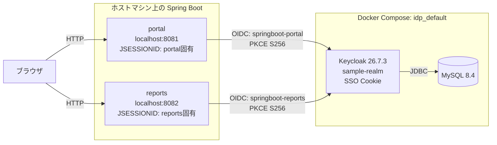
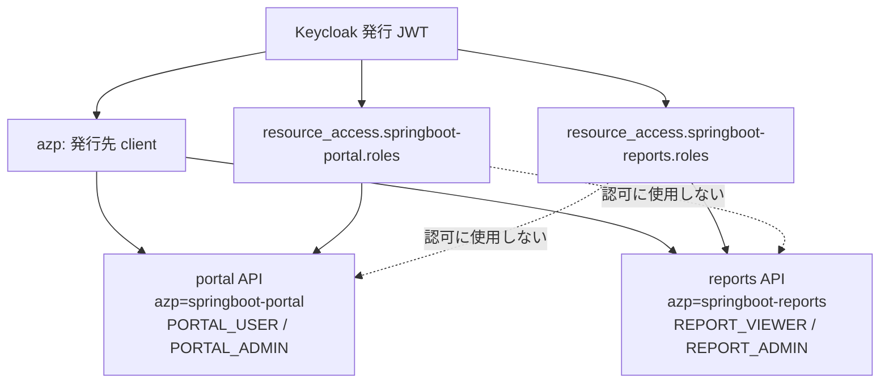

# Keycloak + Spring Boot 4.1 複数システム SSO サンプル

1 つの Keycloak realm を共有する 2 つの Spring Boot システムで、シングルサインオン（SSO）と client role によるシステム別認可を確認するローカル開発用サンプルです。

## システム構成



Keycloak の SSO Cookie と、各アプリの `JSESSIONID` は別の Cookie です。portal でログイン後に reports を開くと、reports は Keycloak にリダイレクトしますが、既存の Keycloak SSO セッションにより資格情報を再入力せずにログインできます。

ブラウザへ返すのは各アプリのセッション識別子（`JSESSIONID`、`HttpOnly`）だけで、アクセストークンそのものは Cookie に保存しません。Spring Security はアクセストークンとリフレッシュトークンをサーバー側の HTTP セッションに保持します。

各プロフィール画面の**ログアウト**は、ローカルの `JSESSIONID` を無効化した後に Keycloak の OIDC RP-Initiated Logout endpoint へ `id_token_hint`、`client_id`、`post_logout_redirect_uri` を送ります。Keycloak の SSO セッションも終了し、ログアウトしたアプリのホームへ戻ります。

## 認可境界



| システム | Keycloak client | ポート | ユーザー API | 管理 API |
| --- | --- | --- | --- | --- |
| portal | `springboot-portal` | `8081` | `GET /api/me`: `PORTAL_USER` | `GET /api/admin`: `PORTAL_ADMIN` |
| reports | `springboot-reports` | `8082` | `GET /api/reports`: `REPORT_VIEWER` | `GET /api/reports/admin`: `REPORT_ADMIN` |

## 必要な環境

- Docker Desktop（Docker Compose v2）
- JDK 21 以上

## 起動

```bash
cp .env.example .env
docker compose up -d
```

次の 2 コマンドは別々のターミナルで実行します。

```bash
./gradlew :portal:bootRun
```

```bash
./gradlew :reports:bootRun
```

- portal: http://localhost:8081
- reports: http://localhost:8082
- Keycloak 管理画面: http://localhost:8080/admin
- Keycloak 管理者: `admin` / `admin-password`

ポート `8080` が使用中の場合は、`.env` の `KEYCLOAK_PORT=18080` を設定します。両アプリは次のように `KEYCLOAK_ISSUER_URI` を指定して起動してください。

```bash
KEYCLOAK_ISSUER_URI=http://localhost:18080/realms/sample-realm ./gradlew :portal:bootRun
KEYCLOAK_ISSUER_URI=http://localhost:18080/realms/sample-realm ./gradlew :reports:bootRun
```

`.env` は Docker Compose 用です。client secret を既定値から変更した場合は、アプリ起動時にも対応する環境変数を渡します。

```bash
PORTAL_CLIENT_SECRET=changed-secret ./gradlew :portal:bootRun
REPORTS_CLIENT_SECRET=changed-secret ./gradlew :reports:bootRun
```

realm をすでに起動済みの場合、client、ロール、検証ユーザー、PKCE、post-logout redirect URI を含む realm 定義の変更を反映するには次を実行します。これは MySQL の保存済みデータを削除します。

```bash
docker compose down -v
docker compose up -d
```

## SSO の確認

1. http://localhost:8081 を開き、**Keycloak でログイン** を選択します。
2. `alice` または `bob` でログインし、portal の `/profile` を表示します。
3. 同じブラウザで http://localhost:8082 を開き、**Keycloak でログイン** を選択します。
4. Keycloak の資格情報入力画面を経由せず、reports の `/profile` が表示されることを確認します。

| ユーザー | パスワード | portal のロール | reports のロール |
| --- | --- | --- | --- |
| `alice` | `alice-password` | `PORTAL_USER` | `REPORT_VIEWER` |
| `bob` | `bob-password` | `PORTAL_USER`, `PORTAL_ADMIN` | `REPORT_VIEWER`, `REPORT_ADMIN` |
| `portal-user` | `portal-user-password` | `PORTAL_USER` | なし |
| `reports-user` | `reports-user-password` | なし | `REPORT_VIEWER` |

`portal-user` は portal の `/profile` と portal API だけを利用できます。`reports-user` は reports の `/profile` と reports API だけを利用できます。どちらも相手システムのトップページは開けますが、Keycloak SSO 後に相手の `/profile` へ進むと `403 Forbidden` になります。

## JWT API の確認

`alice` の portal 用トークンで portal API を呼び出します。

```bash
KEYCLOAK_URL=${KEYCLOAK_URL:-http://localhost:8080}

PORTAL_TOKEN=$(curl -sS -X POST \
  "$KEYCLOAK_URL/realms/sample-realm/protocol/openid-connect/token" \
  -d grant_type=password \
  -d client_id=springboot-portal \
  -d client_secret=portal-client-secret \
  -d username=alice \
  -d password=alice-password | jq -r .access_token)

curl -H "Authorization: Bearer $PORTAL_TOKEN" http://localhost:8081/api/me
curl -i -H "Authorization: Bearer $PORTAL_TOKEN" http://localhost:8082/api/reports
```

2 つ目の要求は `403 Forbidden` です。reports API は `springboot-reports` client に発行されたトークン（`azp=springboot-reports`）だけを受け入れます。

```bash
REPORTS_TOKEN=$(curl -sS -X POST \
  "$KEYCLOAK_URL/realms/sample-realm/protocol/openid-connect/token" \
  -d grant_type=password \
  -d client_id=springboot-reports \
  -d client_secret=reports-client-secret \
  -d username=alice \
  -d password=alice-password | jq -r .access_token)

curl -H "Authorization: Bearer $REPORTS_TOKEN" http://localhost:8082/api/reports
```

Password Grant は API のローカル確認用途のみです。ブラウザの Authorization Code フローでは、両 client とも PKCE `S256` を必須にしています。

## ログアウトの確認

1. portal または reports にログインして、プロフィール画面の**ログアウト**を選択します。
2. アプリの `JSESSIONID` と Keycloak の SSO セッションが終了し、そのアプリのホームへ戻ることを確認します。
3. もう一度そのアプリで**プロフィールを表示**すると、Keycloak のログイン画面が表示されます。

portal からの RP-Initiated Logout は Keycloak の共有 SSO セッションを終了します。ただし、reports がすでに持つ独立した `JSESSIONID` を Keycloak が自動的に無効化するわけではありません。全アプリの既存ローカルセッションも即時に終了させるには、別途 OIDC Back-Channel Logout などを実装します。

## テストと停止

```bash
./gradlew test
docker compose down
```

> この認証情報と Compose 設定はローカル学習用です。本番環境では TLS、Secrets 管理、強固なパスワード、Keycloak の高可用性構成を必ず用意してください。
