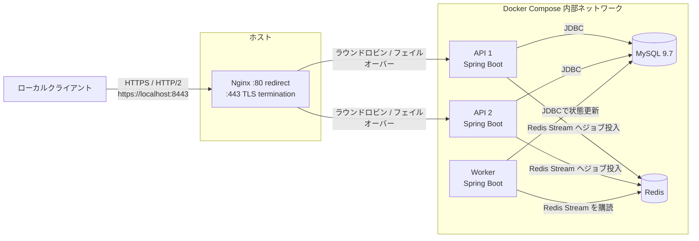

# resilient-api-local

Nginx の負荷分散、Spring Boot API 2 台、MySQL 9.7 LTS、Redis Stream、Java Worker を Docker Compose で動かすローカル向けサンプルです。初期テーブルは Spring Boot の SQL 初期化で作成します。

アプリケーションのビルドには Gradle を使用します。ローカルに Gradle を導入しなくても、`docker compose -f docker/docker-compose.yml up --build` が Gradle コンテナで `bootJar` を実行します。

## ネットワーク構成



## コンテナの役割

| コンテナ | 役割 | ホストへの公開 | 主な接続先 |
| --- | --- | --- | --- |
| `nginx` | 唯一の外部入口。TLS を終端して HTTP/2 を提供し、API 2 台へ負荷分散します。障害時は稼働中の API へフェイルオーバーします。 | `8080:80`（HTTPS へリダイレクト）、`8443:443` | `api-1`、`api-2` |
| `api-1` | ジョブ登録・取得 API を提供する Spring Boot インスタンスです。 | なし | MySQL、Redis |
| `api-2` | `api-1` と同じ役割を担う Spring Boot インスタンスです。Nginx 経由の冗長構成を構成します。 | なし | MySQL、Redis |
| `worker` | Redis Stream からジョブを取得し、処理結果を MySQL の `COMPLETED` または `FAILED` 状態へ更新します。 | なし | Redis、MySQL |
| `mysql` | ジョブと処理状態を永続化する MySQL 9.7.2 データベースです。 | なし | API、Worker |
| `redis` | API がジョブを投入し、Worker が購読する Redis Stream を提供します。 | なし | API、Worker |

MySQL 9.7 は現時点で Flyway の対応対象外のため、このサンプルでは `schema.sql` を使います。Flyway が MySQL 9.7 を正式対応した時点で、`src/main/resources/schema.sql` を Flyway migration へ移行してください。

## 起動

自己署名証明書を生成します。証明書と秘密鍵は Git 管理されません。

```bash
mkdir -p docker/nginx/certs
openssl req -x509 -newkey rsa:2048 -nodes \
  -keyout docker/nginx/certs/localhost.key \
  -out docker/nginx/certs/localhost.crt \
  -days 365 \
  -subj '/CN=localhost' \
  -addext 'subjectAltName=DNS:localhost,IP:127.0.0.1,IP:::1'
```

```bash
cp docker/.env.example docker/.env
docker compose -f docker/docker-compose.yml up --build
```

Nginx だけがホストに公開されます。API は `https://localhost:8443` で利用でき、HTTP/2 をサポートするクライアントは HTTP/2 で接続します。`http://localhost:8080` は同じパスとクエリを HTTPS へ恒久リダイレクトします。MySQL と Redis、各 API の 8080 ポートは Compose ネットワーク内だけで利用できます。

この証明書はローカル開発専用の自己署名証明書です。ブラウザには警告が表示され、`curl` では以下の例のように `--insecure` が必要です。外部公開環境では使用せず、公開 CA の証明書または前段ロードバランサで TLS を終端してください。

## 確認

API の分散先を確認します。

```bash
curl --insecure --http2 https://localhost:8443/api/instance
```

ジョブを登録し、`GET /jobs` で登録済みジョブを確認します。`<id>` の指定は不要です。

```bash
curl --insecure --http2 -X POST https://localhost:8443/jobs \
  -H 'Content-Type: application/json' \
  -d '{"payload":"send welcome email","shouldFail":false}'

curl --insecure --http2 https://localhost:8443/jobs/
```

Worker が Redis Stream から処理し、状態は `PENDING` から `COMPLETED` になります。`shouldFail` を `true` にすると、再試行せず `FAILED` を記録します。

片方の API を停止しても、Nginx はもう一方へ転送します。

```bash
docker compose -f docker/docker-compose.yml stop api-1
curl --insecure --http2 https://localhost:8443/api/instance
```

Nginx が Docker DNS で API を動的に再解決するため、停止後の要求は `{"instanceId":"api-2"}` のように稼働中の API から応答されます。

## 停止とデータ削除

```bash
docker compose -f docker/docker-compose.yml down
docker compose -f docker/docker-compose.yml down -v
```

後者は MySQL の named volume を削除します。
