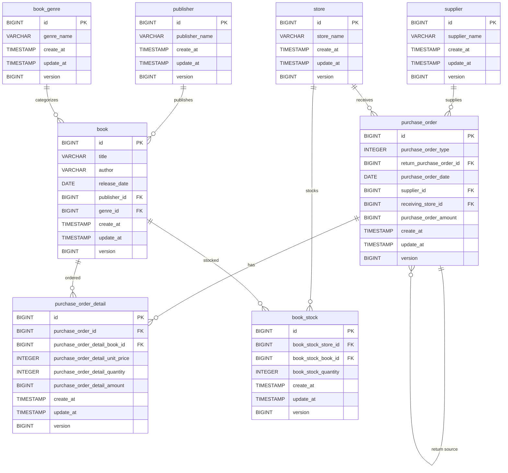

# spec
http://localhost:8080/swagger-ui/index.html#/

http://localhost:8080/scalar

# gradleのタスク

```shell
./gradlew domaCodeGenAll
./gradlew runMyBatisGenerator
./gradlew test
```

# ER図


```mermaid
erDiagram
    publisher ||--o{ book : "publishes"
    book_genre ||--o{ book : "categorizes"
    supplier ||--o{ purchase_order : "supplies"
    store ||--o{ purchase_order : "receives"
    purchase_order ||--o{ purchase_order : "return source"
    purchase_order ||--o{ purchase_order_detail : "has"
    book ||--o{ purchase_order_detail : "ordered"
    store ||--o{ book_stock : "stocks"
    book ||--o{ book_stock : "stocked"

    publisher {
        BIGINT id PK
        VARCHAR publisher_name
        TIMESTAMP create_at
        TIMESTAMP update_at
        BIGINT version
    }

    book_genre {
        BIGINT id PK
        VARCHAR genre_name
        TIMESTAMP create_at
        TIMESTAMP update_at
        BIGINT version
    }

    book {
        BIGINT id PK
        VARCHAR title
        VARCHAR author
        DATE release_date
        BIGINT publisher_id FK
        BIGINT genre_id FK
        TIMESTAMP create_at
        TIMESTAMP update_at
        BIGINT version
    }

    supplier {
        BIGINT id PK
        VARCHAR supplier_name
        TIMESTAMP create_at
        TIMESTAMP update_at
        BIGINT version
    }

    store {
        BIGINT id PK
        VARCHAR store_name
        TIMESTAMP create_at
        TIMESTAMP update_at
        BIGINT version
    }

    purchase_order {
        BIGINT id PK
        INTEGER purchase_order_type
        BIGINT return_purchase_order_id FK
        DATE purchase_order_date
        BIGINT supplier_id FK
        BIGINT receiving_store_id FK
        BIGINT purchase_order_amount
        TIMESTAMP create_at
        TIMESTAMP update_at
        BIGINT version
    }

    purchase_order_detail {
        BIGINT id PK
        BIGINT purchase_order_id FK
        BIGINT purchase_order_detail_book_id FK
        INTEGER purchase_order_detail_unit_price
        INTEGER purchase_order_detail_quantity
        BIGINT purchase_order_detail_amount
        TIMESTAMP create_at
        TIMESTAMP update_at
        BIGINT version
    }

    book_stock {
        BIGINT id PK
        BIGINT book_stock_store_id FK
        BIGINT book_stock_book_id FK
        INTEGER book_stock_quantity
        TIMESTAMP create_at
        TIMESTAMP update_at
        BIGINT version
    }
```

