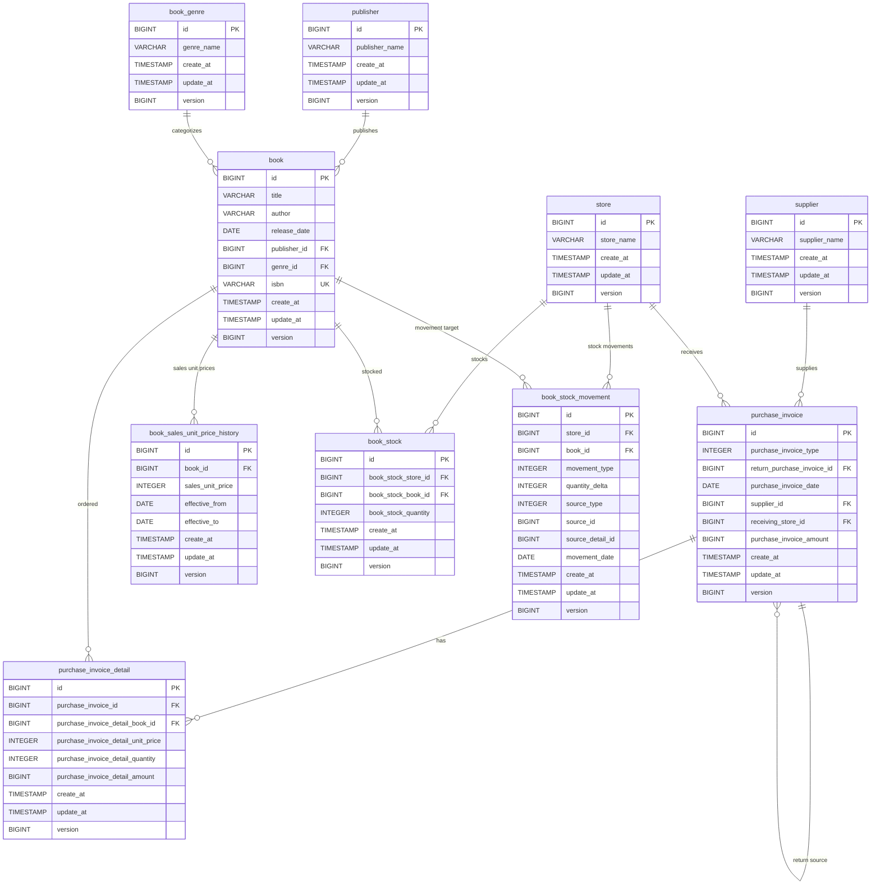

# 概要→詳細は[AGENTS.md](https://github.com/nagaokambeyond/samples/blob/main/spring_java_orm_sample/AGENTS.md)で

- framework→spring boot 4.1
- database→H2
- ORM
  - JPA
  - MyBatis
  - Doma3
  - jOOQ
- entityの自動生成あり
- api仕様
  - swagger-ui→http://localhost:8080/swagger-ui/index.html#/
  - scalar→http://localhost:8080/scalar

# gradleのタスク

```shell
./gradlew domaCodeGenAll
./gradlew runMyBatisGenerator
./gradlew generateJooq
./gradlew test
./gradlew clean nativeCompile
```

# ER図


# パフォーマンス比較

## graalvm

```bash
./gradlew clean nativeCompile
./build/native/nativeCompile/demo --spring.profiles.active=doma,native
```

```log
2026-08-19T07:27:13.697+09:00  INFO 6336 --- [demo] [           main] com.example.demo.DemoApplication         : Started DemoApplication in 0.295 seconds (process running for 0.32)
2026-08-19T07:28:24.412+09:00  INFO 6336 --- [demo] [nio-8080-exec-9] c.example.demo.api.log.ApiInterceptor    : ✅[API END] GET /api/books/1 -> 200 (13 ms)
2026-08-19T07:29:40.622+09:00  INFO 6336 --- [demo] [nio-8080-exec-6] c.example.demo.api.log.ApiInterceptor    : ✅[API END] POST /api/auth/login -> 200 (210 ms)
2026-08-19T07:31:29.111+09:00  INFO 6336 --- [demo] [nio-8080-exec-9] c.example.demo.api.log.ApiInterceptor    : ✅[API END] POST /api/books/create -> 200 (48 ms)
```

## jdk

```log
2026-08-19T22:15:19.361+09:00  INFO 7290 --- [demo] [  restartedMain] com.example.demo.DemoApplication         : Started DemoApplication in 3.859 seconds (process running for 4.187)
2026-08-19T22:16:13.668+09:00  INFO 7290 --- [demo] [nio-8080-exec-2] c.example.demo.api.log.ApiInterceptor    : ✅[API END] GET /api/books/1 -> 200 (97 ms)
2026-08-19T22:15:51.662+09:00  INFO 7290 --- [demo] [nio-8080-exec-1] c.example.demo.api.log.ApiInterceptor    : ✅[API END] POST /api/auth/login -> 200 (263 ms)
2026-08-19T22:18:11.665+09:00  INFO 7290 --- [demo] [nio-8080-exec-4] c.example.demo.api.log.ApiInterceptor    : ✅[API END] POST /api/books/create -> 200 (46 ms)
```
